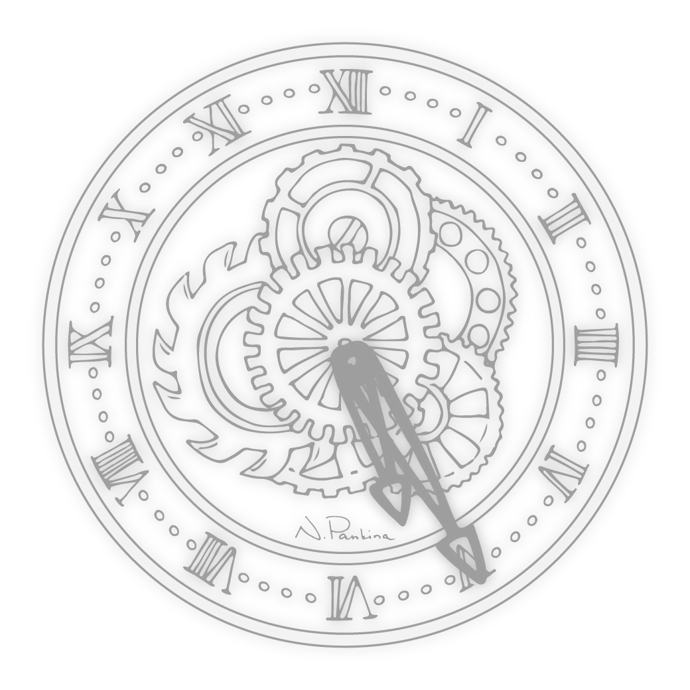
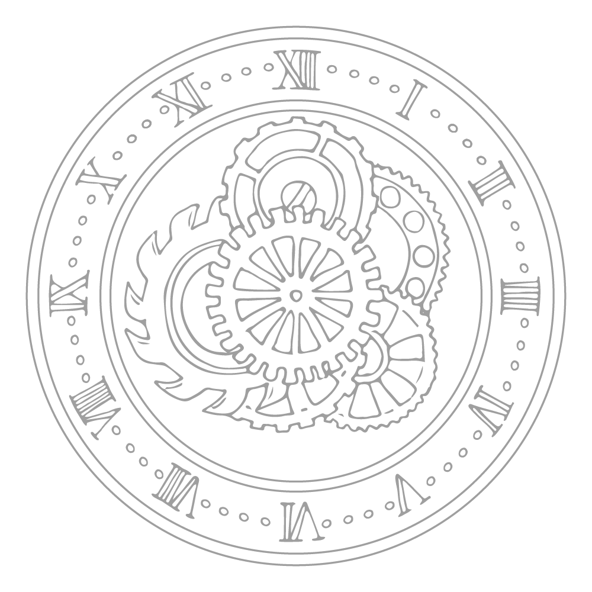
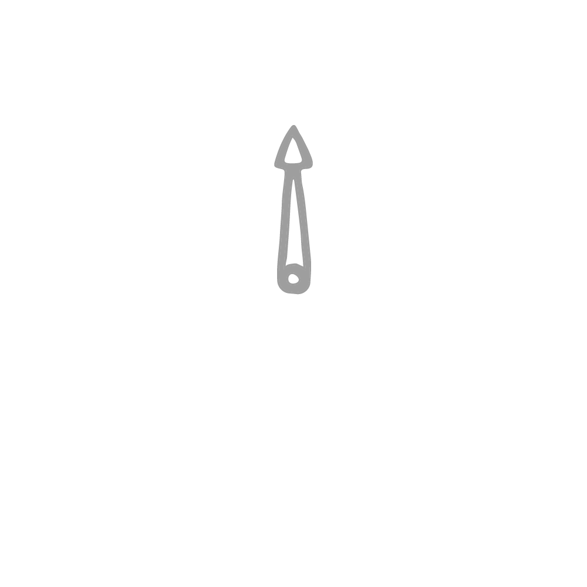
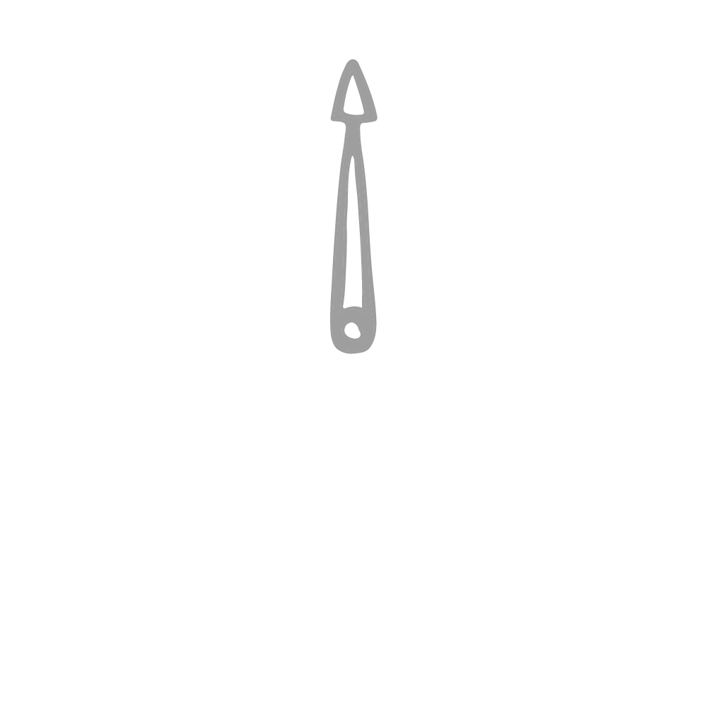

## Natasha Pankina's Clocky

GeekTool analog clock handdrawn by Natasha



I wanted something pretty clock-wise on my desktop. So illutrator [Natasha Pankina](https://natasha-pankina.com) drew the clock components, and the included bash file uses imagemagick to build the components into a final image as seen above.

The [clock.sh](./clock.sh) rebuilds the image from the components, and a crontab generates the image every minute. GeekTool is set up to refresh at the same interval.

You'll want to update the paths to reflect where you put the scripts, but this is what I did in my crontab.

```bash
 * * * * * cd /Users/mark.phillips/Developer/.dotfiles/np-clocky/ && sh /Users/mark.phillips/Developer/.dotfiles/np-clocky/clock.sh
```

### clock parts

Clock background



Clock hour-hand



Clock minute-hand



### crontab script

Just to test all the paths were set properly.

```bash
 #!/bin/bash

./clock.sh && rm -rf .clock.tmp.*.png && echo "${PWD}/clock.final.png generated"
# imgcat ./.clock.final.png
```

### script

Requires ImageMagick

```bash
#!/usr/bin/env bash

# Path to ImageMagick convert program
conv="/usr/local/bin/convert -quiet"

# IMPORTANT: Set this to the path where the images and the script reside.
# basedir=$HOME"/bin/clock/"
basedir="./"

# Time in hours
hourtime=`date "+%H"`
if [ "$hourtime" -gt "12" ]
then
        hourtime=`expr $hourtime - 12`
        # now $hourtime = hours since 12
fi

# Time in minutes
minutetime=`date "+%M"`

# 1 find angle of hour arm
hourasminutes=`expr $hourtime \* 60`
minutessincetwelve=`expr $hourasminutes + $minutetime`
hourangle=`expr $minutessincetwelve / 2`

# 2 find angle of minute arm
minuteangle=`expr $minutetime \* 6`

# 3 combine bg and hour arm
$conv ${basedir}hour_1000x1000.png -virtual-pixel transparent \
+distort SRT "500,500 1.0 $hourangle 500,500" \
-trim ${basedir}bg_1000x1000.png +swap -background none \
-layers merge +repage ${basedir}.clock.tmp.part1.png

# 4 combine result of 3 with minute arm
$conv ${basedir}minute_1000x1000.png -virtual-pixel transparent \
+distort SRT "500,500 1.0 $minuteangle 500,500" \
-trim ${basedir}.clock.tmp.part1.png +swap -background none \
-layers merge +repage ${basedir}.clock.tmp.part2.png

# 5 add drop shadow
$conv ${basedir}.clock.tmp.part2.png -virtual-pixel transparent \
-background none \( +clone -background none -shadow 30x10+0+0 \) \
+swap -layers merge +repage ${basedir}.clock.final.png

```
